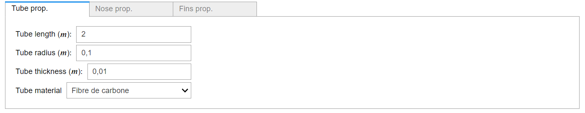
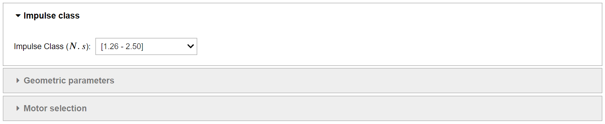
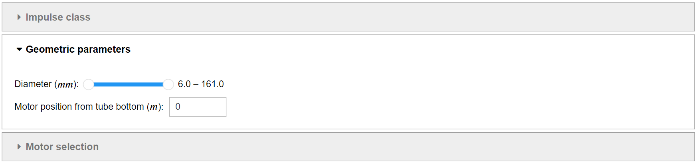
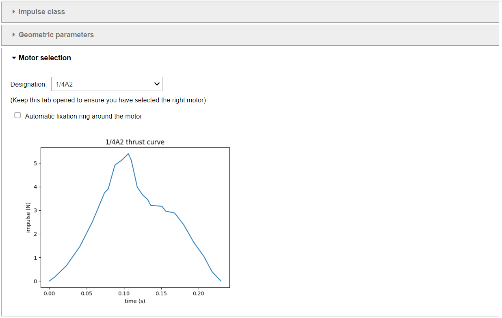
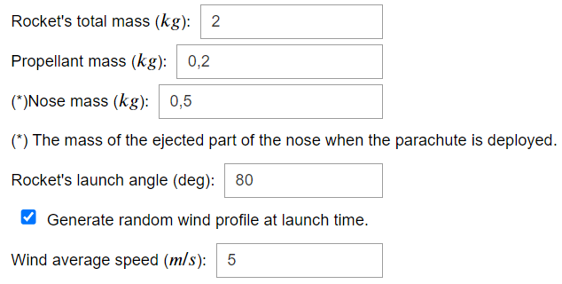
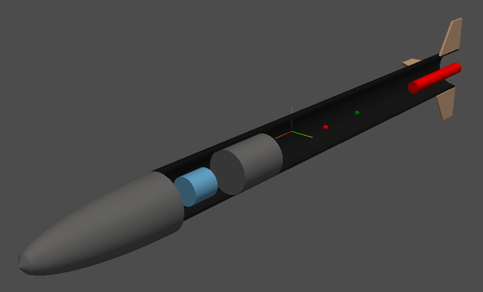
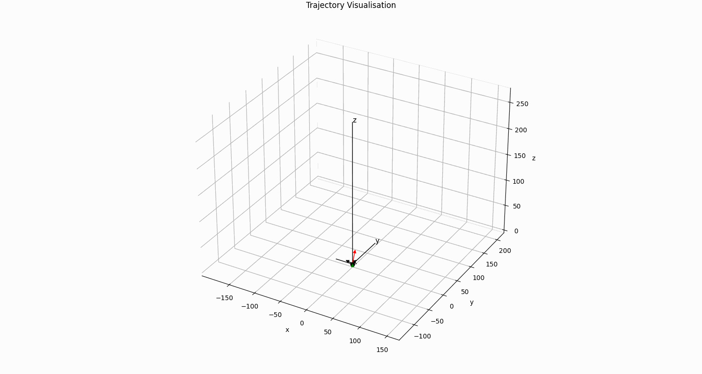

# rocket-twin - PSC - X rocket

rocket-twin is a 6 degree of freedom digital-twin of a rocket. You can create a rocket interactively through a jupyter notebook, visualize it and plot its flight trajectory.

This library was built with CoSApp, an open source framework allowing complex systems simulation. You can read more about it [here](https://cosapp.readthedocs.io/en/latest/).

## Getting Started

After cloning the repository thanks to
```bash
git clone https://github.com/twiinIT/rocket-twin.git
```

install the dependencies via

```bash
pip install -r requirements.txt
```

## How to use

In order to use the graphic interface, move to the UI directory
and browse the jupyter notebook `user_interface.ipynb`.

## Overview

Create your own rocket using `user_interface.ipynb` by specifying its geometric and mass properties in widgets.



Chose the right motor for your rocket from a large database using a simple browser widget.







Chose the flight parameters for a more realistic simulation.

The project provides a random wind profile generator to test your rocket's stability.




When everything is specified, visualise the 3D model of your rocket to verify if the geometry matches your design.



You're now ready to go for a simulation !




## Contributing

Please contact TwiinIT if you want to contribute to this project.
